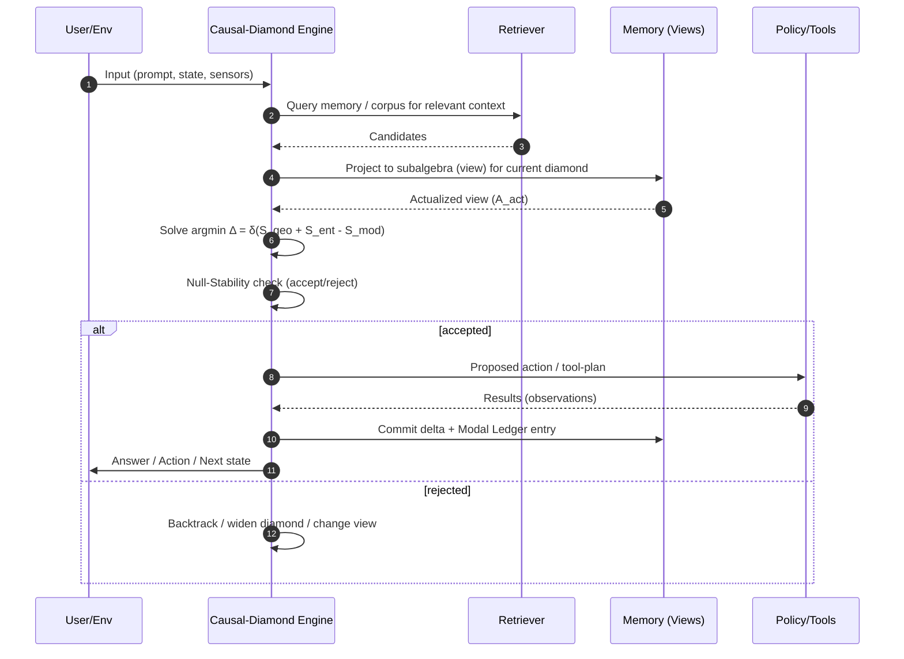
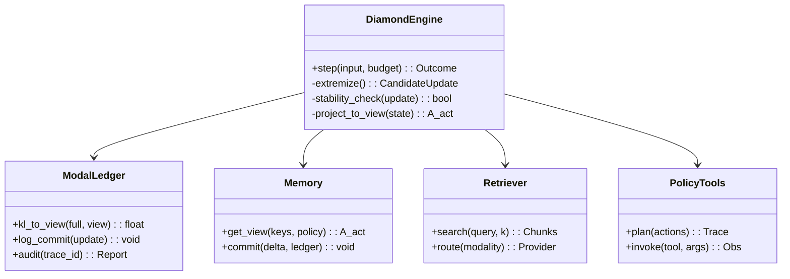
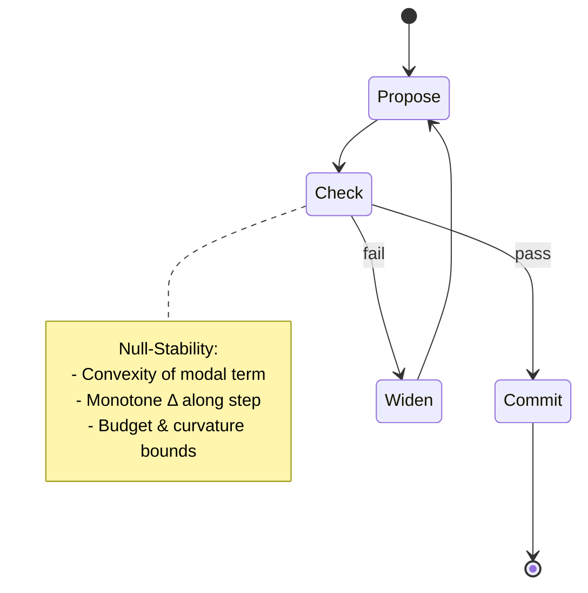

# Reality’s Ledger — A Causal‑Diamond Engine for General‑Purpose Intelligence

> **Tagline:** A reasoning system that *extremizes information* on nested contexts (“causal diamonds”) to decide what to attend to, what to remember, and what to do next—under principled stability constraints.

---

## Why this exists

Modern LLMs are extraordinary pattern learners, but they struggle with **stable multi‑step reasoning**, **long‑horizon memory**, **uncertainty accounting**, and **interpretable control of attention**. **Reality’s Ledger** proposes a compact, testable architecture that treats a model’s current working context as a *causal diamond* (a bounded region of space‑time/compute), and drives inference by **extremizing a single objective** over three channels:

1. **Geometric (capacity/structure):** what the model can represent and how expensive it is.
2. **Entanglement (informational coupling):** what the current evidence says (attention/likelihood).
3. **Modal (ledger/actualization):** how “costly” it is to commit to one actualized summary of possibilities vs. keep ambiguity (uncertainty budget & exploration).

This structure is inspired by the master variational law in the Modal Emergent Quantum Gravity (MEQG) program, where generalized entropy on causal diamonds is extremized,
[
\delta\big(S_\text{geo} + S_\text{ent} - S_\text{mod}\big)=0,
]
with the **modal term defined canonically as a relative entropy** and subject to **null‑stability** (a convexity/monotonicity constraint). We adapt those ideas as *engineering principles* for machine reasoning, not as a claim about physics inside our software. 

---

## What this repository provides

* A **Causal‑Diamond Engine (CDE)** that runs reasoning in **nested, time‑bounded contexts**.
* An explicit **Modal Ledger** that tracks *how much uncertainty we collapsed* to make each step.
* A principled **Null‑Stability** update test that rejects brittle steps and prevents error cascades.
* Pluggable **retrieval, planning, and tool‑use** modules that operate inside each diamond.
* A research‑grade **trainer** that optimizes a **single objective** mirroring (\delta(S_\text{geo}+S_\text{ent}-S_\text{mod})=0).

---

## Architecture at a glance

```mermaid
flowchart TD
    U[User / Environment] -->|prompt, state| DIAMOND[Causal-Diamond Engine]
    subgraph DIAMOND[Causal-Diamond Engine]
        A[Geometric Channel\n(capacity & structure prior)] --- E[Extremizer]
        B[Entanglement Channel\n(attention & evidence)] --- E
        C[Modal Ledger\n(uncertainty & actualization)] --- E
        E -->|candidate actions / hypotheses| POL[Policy & Tools]
        E -->|update| MEM[Memory (Subalgebras/Views)]
        E -->|stability check| STAB[Null-Stability]
        STAB -->|accept/reject| E
    end
    POL -->|tool calls / API| Tools[(External Tools)]
    POL -->|actions| U
    MEM <--> RETR[Retriever (Vector/Graph DB)]
```

**Mapping of channels → software:**

* **Geometric** → architecture priors (depth/width/buffers), compute cost regularizers, structural constraints.
* **Entanglement** → attention, likelihood terms, gradient signals from observations/tools.
* **Modal** → relative‑entropy–like penalty between *full latent state* and an *actualized subspace* (the “view” we commit to when deciding), i.e., an explicit *uncertainty/commitment ledger*.

The **update rule** extremizes the sum of these contributions while enforcing a **null‑stability** condition (a monotonicity/convexity test across the diamond’s update trajectory). This mirrors the MEQG derivation where the modal piece tightens stability bounds. 

---

## How the system works (step‑by‑step)



**Key mechanics**

* **Causal diamond** = a bounded compute/time context with fixed anchors (start/end, budget).
* **Actualized subalgebra (view)** = the subset of features/variables we *commit to* for this step.
* **Modal ledger** = a KL‑like term that measures information lost when projecting to the view.
* **Null‑stability** = reject updates that increase a local instability functional (think “QFC/QNEC‑style” monotonicity), preserving robustness across steps. 

---

## Why this likely improves on today’s LLMs

1. **Principled uncertainty accounting.** The *Modal Ledger* is a first‑class citizen; every decisive step records how much ambiguity we collapsed, improving calibration and debuggability. 
2. **Context as a controllable primitive.** Reasoning runs on **nested, bounded contexts** (diamonds), enabling explicit long‑horizon plans with local consistency checks (accept/reject at each boundary).
3. **A single, testable objective.** Like the MEQG master law, one extremization governs behavior; no sprawling ad‑hoc losses. 
4. **Stability by construction.** The **null‑stability** condition avoids brittle chains; the model doesn’t proceed if it can’t certify local convexity/improvement (reducing hallucinations/cascades). 
5. **Retrieval as conditional expectation.** “Views” are **modular‑invariant projections**—retrieval becomes *project‑then‑reason*, not dump‑and‑hope; this keeps context compact and on‑target. 
6. **Environmental selectivity.** The engine can express **compact spectral windows** (e.g., focus on “void‑like” sparse knowledge) to hunt for weak but decisive evidence without destabilizing the rest. 
7. **Resource awareness.** The geometric term makes compute/memory part of the objective, enabling **graceful degradation** and **budget‑aware** planning.
8. **Interpretable memory edits.** The ledger logs which chunks were projected/committed; this yields **explanations** for why a belief changed.
9. **Falsifiable updates.** Every step either passes or fails a crisp stability test—easy to monitor in production.
10. **Unification across modalities.** The same diamond/ledger machinery applies to text, code, tools, and sensors, helping close gaps on the path to **AGI‑level flexibility**.

---

## Mathematical core (engineering view)

* **Objective (per diamond (D))**
  [
  \min_{\theta,,\text{view }A_\text{act}}\ \Delta(D) \equiv \delta S_\text{geo}(\theta, D) + \delta S_\text{ent}(\theta, D) - \delta S_\text{mod}(\theta, A_\text{act}; D)
  ]
  where:

  * (\delta S_\text{geo}) = capacity/structure regularizer (compute/latency/complexity curvature).
  * (\delta S_\text{ent}) = data‑fit/attention (modular‑Hamiltonian‑like local likelihood/contrastive term).
  * (\delta S_\text{mod}) = **relative‑entropy** between the full posterior and the **conditional expectation onto (A_\text{act})** (our actualized view). 
* **Constraint (null‑stability):** second‑variation along the update direction is **non‑positive** (monotone), else reject and widen the view or adjust the step. 

> *In MEQG, the modal term is defined canonically as a relative entropy on a modular‑invariant subalgebra; its convexity tightens stability (QFC/QNEC‑style). We use the same convexity to police learning/inference updates.* 

---

## Component model



---

## Repository structure (languages included)

```text
realitys-ledger/
├─ apps/
│  ├─ cli/                         # (Rust)  Fast local runner, REPL driver
│  └─ server/                      # (Rust)  gRPC/HTTP inference server
├─ engine/
│  ├─ diamond/                     # (Rust)  Causal-Diamond Engine core
│  ├─ entanglement/                # (Rust)  Attention/evidence modules
│  ├─ modal/                       # (Rust)  Modal Ledger (KL, views, convexity)
│  ├─ geometry/                    # (Rust)  Capacity/compute priors, budgets
│  ├─ stability/                   # (Rust)  Null-stability certificates & tests
│  └─ bindings/
│     ├─ python/                   # (Python) PyO3 bindings
│     └─ cpp/                      # (C++)   Native embedding
├─ memory/
│  ├─ vector/                      # (Rust)  FAISS/HNSW wrappers via FFI
│  ├─ graph/                       # (Rust)  Typed knowledge graph store
│  └─ views/                       # (Rust)  Subalgebra (view) generators
├─ retrievers/
│  ├─ text/                        # (Rust)  BM25, hybrid, rerankers
│  ├─ code/                        # (Rust)  AST-aware retrieval
│  └─ multimodal/                  # (Rust)  Image/audio/sensor retrieval
├─ tools/
│  ├─ planner/                     # (Rust)  Tool-plan synthesis
│  ├─ sandbox/                     # (Rust)  Safe tool execution
│  └─ connectors/                  # (Rust)  External APIs
├─ python/
│  ├─ trainer/                     # (Python) Training loops, schedulers
│  ├─ losses/                      # (Python) Δ objective terms (geo/ent/modal)
│  ├─ datasets/                    # (Python) Task and synthetic curricula
│  └─ notebooks/                   # (Python) Prototyping & ablations
├─ cpp/
│  └─ kernels/                     # (C++)   Custom ops (CUDA), fast KL, convexity
├─ web/
│  ├─ ui/                          # (TypeScript) Operator dashboard
│  └─ docs-site/                   # (TypeScript) Static docs
├─ ops/
│  ├─ ci/                          # (YAML) CI pipelines, reproducibility checks
│  ├─ deploy/                      # (Terraform/K8s) Deploy manifests
│  └─ eval/                        # (Python) Bench & regression suites
├─ docs/
│  ├─ theory/                      # (Markdown) Conceptual mapping to MEQG
│  ├─ design/                      # (Markdown) Design records & decisions
│  └─ api/                         # (Markdown) Public API
└─ LICENSE
```

**Tech choices**

* **Rust** for the latency‑critical engine, safety, and FFI.
* **Python** for training, experiments, and data pipelines.
* **C++/CUDA** for performance‑critical kernels.
* **TypeScript** for the operator UI and docs site.
* **Terraform/K8s** for reproducible deployment.

---

## Training & evaluation

```mermaid
flowchart LR
  CURR[Curriculum / Tasks] --> LOSS[Δ Objective\n(geo + ent - mod)]
  OBS[Observations/Tools] --> LOSS
  LOSS --> SOLVER[Optimizer]
  SOLVER --> PARAMS[Model Params θ]
  PARAMS --> ROLL[Rollouts in Diamonds]
  ROLL --> METRICS[Stability, Calibration,\nTask reward, Tool success]
  METRICS -->|early stop/anneal| SOLVER
```

* **Loss:**
  (\mathcal{L} = \mathbb{E}*D\big[\delta S*\text{geo} + \delta S_\text{ent} - \delta S_\text{mod}\big] + \lambda \cdot \text{penalty}(\text{violations of null‑stability}))
  where (\delta S_\text{mod}) is a **KL‑style** deviation between the full posterior and the *actualized* view (conditional expectation). 
* **Stability audit:** every rollout logs **convexity certificates**; violations are treated as defects.
* **Metrics:** reasoning depth before failure, calibration curves, tool‑success under long‑horizon plans, and **ledger efficiency** (useful commitments per bit of collapsed uncertainty).

---

## Interactions with tools and memory

* **Views as “subalgebras.”** Memory returns a *view* that is invariant under the model’s current “modular flow” (i.e., insensitive to irrelevant detail at this step), echoing the MEQG **conditional expectation** construction. 
* **Selective “windows.”** The engine can use **compact windows** to highlight sparse but decisive evidence (e.g., in code‑search or rare‑event diagnostics) without globally changing attention. 

---

## Safety & robustness by design



* **Reject brittle steps**: if the update fails null‑stability (non‑monotone Δ or failing curvature/budget bounds), the engine widens the view or backtracks.
* **Auditable ledger**: each commit includes *why* we collapsed uncertainty and *how much*; operators can inspect or roll back.

---

## Quick start (research)

1. **Build engine & server**

   ```bash
   cargo build -p server
   ```
2. **Python bindings**

   ```bash
   maturin develop -m engine/bindings/python/Cargo.toml
   ```
3. **Run a toy curriculum**

   ```bash
   python -m python.trainer.run --task=tool_reasoning --budget=2.0
   ```

---

## Roadmap & falsifiable milestones

* **R1**: Beat strong LLM baselines on *multi‑step tool use* with fewer error cascades at fixed budget (**stability advantage**).
* **R2**: Demonstrate **ledger calibration**: uncertainty bids predict actual error rates within ±5% across tasks.
* **R3**: **Ablation** shows removing the modal term or the null‑stability gate degrades long‑horizon success ≥10%.
* **R4**: **Memory edits** are interpretable via ledger diffs and reproducibly improve downstream performance.

These are the software analogs of the “kill‑numbers” ethos—set crisp, pre‑registered thresholds and publish the result either way. 

---

## Notes on provenance

This project’s **design principles** draw on the MEQG blueprint in which a **single variational statement on causal diamonds** balances geometric, entanglement, and **modal (relative‑entropy)** contributions and enforces **null‑stability** (QFC/QNEC‑style). We **translate** those ideas into machine reasoning objectives, memory projections (“subalgebras/views”), and stability gates; the physics text provides **conceptual justification** for the pieces but we claim **software‑engineering value**, not a physical theory, inside this repository. 


## Citation

If you use this repository in research, please cite this README and the MEQG source that motivates the diamond/ledger/stability structure. The canonical MEQG presentation of the master law, modal relative entropy, conditional expectations, and null‑stability can be found in *Reality’s Ledger: An Introduction to Modal Emergent Quantum Gravity*. 

> *“Extremize A/4Gℏ + S_ent − S_mod on diamonds and enforce null‑stability… In the small‑diamond limit this yields local balance; the modal piece, defined as a (negative) relative entropy, tightens the stability bounds.”* 

---

*End of README.*


Medical References:
1. None — DOI: file-Fuy6gZtozJ38EderqRGrr7
