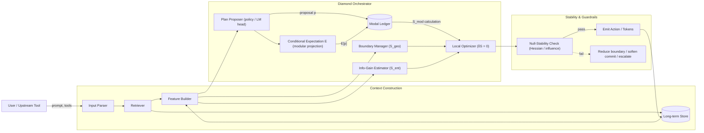
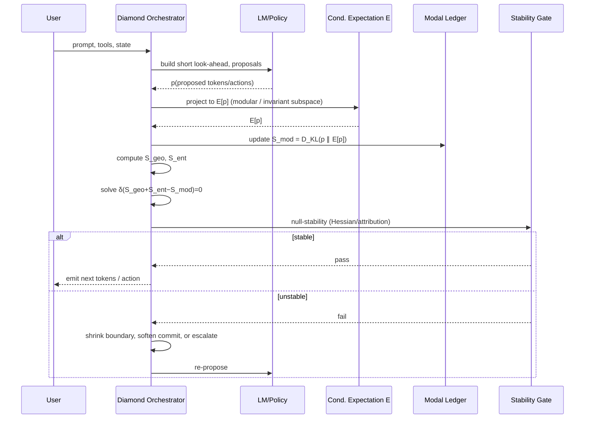
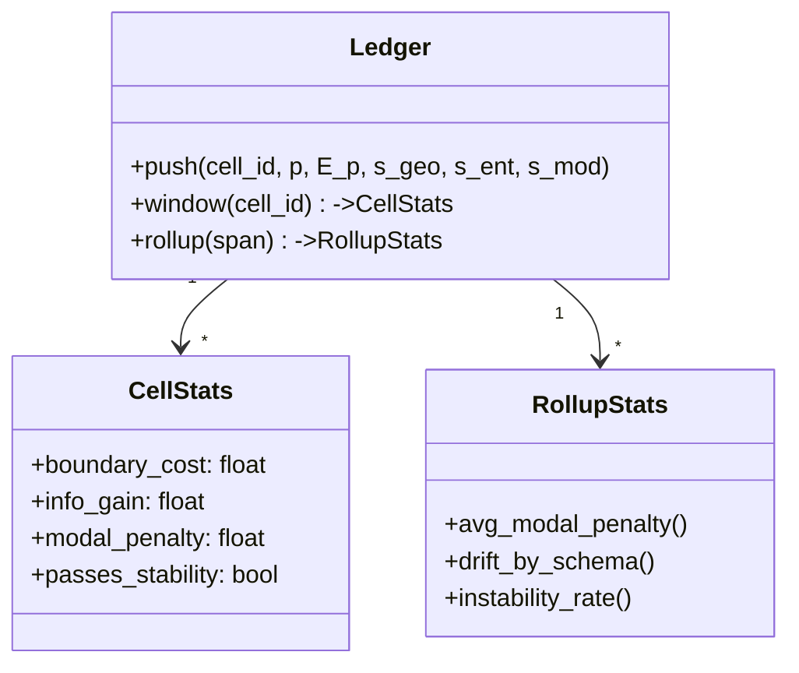
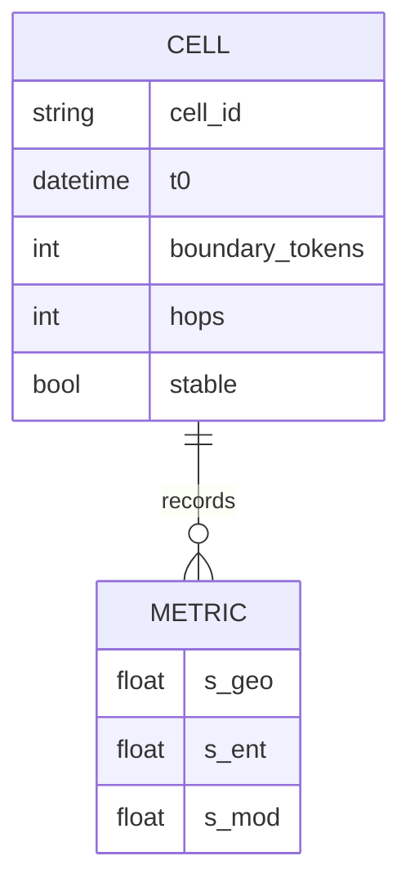

# architecture.md — **Modal‑Ledger AI (ML‑AI)**

> A pragmatic AI architecture inspired by *causal‑diamond* variational mechanics: at each bounded context “diamond,” maximize useful information while penalizing premature commitment to a single branch. The system extremizes
> **S = S_geo + S_ent − S_mod**
> subject to a local stability check, then advances one step.

**Provenance & theory hook.** The design takes conceptual cues from a variational law on *causal diamonds*—a local region with a null (information‑carrying) boundary—where stationarity of a generalized entropy yields dynamics; a new *modal* term is defined as a relative entropy against a covariant coarse‑graining and must satisfy a local stability (focusing) inequality. We translate those ideas into concrete components for training, inference, and safety in modern LLM systems. 

---

## 1) Why this architecture?

### 1.1 Plain‑language idea

* **Reason in small windows.** Build decisions inside short, bounded “diamonds” of context (prompt + retrieved state + short look‑ahead) rather than the whole conversation at once.
* **Balance three forces per diamond.**

  * **Structure cost** (*S_geo*): prefer simpler, smaller boundaries (fewer tokens/hops/edges).
  * **Information gain** (*S_ent*): prefer actions that maximally reduce predictive uncertainty about near‑future tokens or task targets.
  * **Modal discipline** (*S_mod*): penalize “over‑actualizing” one branch when evidence is thin (computed as a relative entropy between a proposal distribution and its *conditional‑expectation* coarse‑grain).
* **Proceed only if stable.** Along directions that *should not* carry influence (null directions in this compute window), the second derivative of the objective must not go the wrong way (a “null‑stability” Hessian check).

### 1.2 Physics‑to‑AI dictionary (mental model)

| Causal‑diamond mechanics term                                                | AI analogue in ML‑AI                                                                                                                  |
| ---------------------------------------------------------------------------- | ------------------------------------------------------------------------------------------------------------------------------------- |
| Causal diamond (D) (bounded region; null boundary)                           | Windowed **reasoning cell**: {current context, retrieved snippets, short look‑ahead}                                                  |
| (S_\text{geo}) (area / geometric term)                                       | **Boundary/complexity regularizer** on context size, hops, heads, or cross‑module edges                                               |
| (S_\text{ent}) (entanglement; first law)                                     | **Information gain / log‑likelihood improvement** on next‑k tokens, tool outputs, or targets                                          |
| (S_\text{mod}) (modal deficit; relative entropy vs. conditional expectation) | **Branch‑overcommitment penalty**: (D_\mathrm{KL}(p(\text{plan}) ,|, E[p])) where (E) is a symmetry‑/invariance‑preserving projection |
| Stationarity (\delta(S_\text{geo}+S_\text{ent}-S_\text{mod})=0)              | **Per‑cell optimizer step** that balances structure, utility, and prudence                                                            |
| Null‑stability (QFC/QNEC‑style bound)                                        | **Safe‑advance test**: local Hessian/curvature checks along “no‑signal” directions must pass                                          |

---

## 2) System overview



**Key components.**

* **Boundary Manager (S_geo).** Regularizes context breadth: caps retrieved tokens, tool hops, cross‑attention edges.
* **Info‑Gain Estimator (S_ent).** Measures expected uncertainty reduction from candidate actions (e.g., mutual information with a short look‑ahead decoder head).
* **Modal Ledger (S_mod).** Tracks *how much* a proposal deviates from a modularly coarse‑grained prior (E[p]) (see §4).
* **Local Optimizer.** Balances the three terms; emits the least‑bias step that still moves the task forward.
* **Null‑Stability.** A quick curvature/influence test; if it fails, narrow the boundary or de‑emphasize brittle evidence.

---

## 3) The **causal‑diamond** reasoning cycle



---

## 4) The **Modal Ledger** in practice

### 4.1 What is the conditional expectation (E)?

Intuitively: a *projection* onto an “actualized” subspace that preserves invariants (e.g., factual constraints, tool contracts, schema). We implement (E) as either:

* **Modular‑dephasing (mean‑ergodic) projection.** Time‑average the proposal distribution under a symmetry‑preserving flow (e.g., invariance to paraphrase, variable renaming, or tool‑contract permutations) until drift falls below a tolerance.
* **Schema‑aware marginalization.** Keep only marginals on *actionable* facets (API verb, arguments in canonical order, safety flags), dropping superfluous degrees of freedom.

Then define the **modal penalty** per diamond:
[
S_\text{mod} ;=; D_\mathrm{KL}!\big(p(\text{plan}) ,|, E[p]\big).
]

> *Reading tip.* In the source theory, the modal term is formalized as a relative entropy against a covariant conditional expectation, guaranteeing positivity and monotonicity under further coarse‑graining. 

### 4.2 Ledger data model



---

## 5) Objective and update rule

### 5.1 Per‑diamond objective

[
\mathcal{S} ;=; \underbrace{\lambda_\text{geo},\Omega(\text{boundary})}*{S*\text{geo}}
;+; \underbrace{\mathbb{E}\big[\Delta \mathrm{NLL}*{t:t+k}\big]}*{S_\text{ent}}
;-; \underbrace{D_\mathrm{KL}!\big(p ,|, E[p]\big)}*{S*\text{mod}}.
]

* **(\Omega)**: convex surrogate for boundary size/complexity (tokens, hops, edges).
* **(\Delta \mathrm{NLL}_{t:t+k})**: expected negative‑log‑likelihood reduction on a short horizon.
* **(D_\mathrm{KL})**: modal penalty; **larger** when proposals deviate from invariant coarse‑grain.

**Stationarity step.** Apply a one‑ or two‑step optimizer (e.g., implicit gradient, proximal update) to drive (\delta \mathcal{S} = 0) within a small trust region.

### 5.2 Null‑stability test (fast)

* **Hessian slice:** compute (v^\top \nabla^2 \mathcal{S}, v) on *null* directions (v) (features that shouldn’t change the outcome—e.g., paraphrase tokens, order of commutative args). Require (v^\top \nabla^2 \mathcal{S}, v \le 0).
* **Attribution no‑leak:** integrated‑gradients to ensure those null features have ≈0 attribution.
* **If fail:** shrink boundary, reduce commitment (temperature/entropy), or escalate to a safer planner.

---

## 6) Training

```mermaid
flowchart TD
  D[Dataset / Telemetry] --> P1[Preprocess & Label null dirs]
  P1 --> R1[Retriever Warmup]
  R1 --> LM[LM / Policy Finetune]
  LM --> H1[Horizon Head (k-step)]
  H1 --> O1[Compute S_ent]
  LM --> E1[Build E (schema / modular)]
  E1 --> O2[Compute S_mod = KL(p ∥ E[p])]
  P1 --> O3[Boundary signals for S_geo]
  O1 --> J[Joint Loss]
  O2 --> J
  O3 --> J
  J --> OPT[Update (AdamW / Prox)]
```

**Joint loss (teacher‑forced, train‑time):**
[
\mathcal{L} ;=; \mathrm{NLL} ;+; \alpha,\underbrace{\big\lVert \nabla_\text{null},\mathrm{NLL} \big\rVert^2}*{\text{stability reg.}}
;+; \beta, D*\mathrm{KL}!\big(p ,|, E[p]\big) ;+; \gamma, \Omega(\text{boundary}).
]

* **Stability regularizer** teaches the model to be insensitive along labeled null directions.
* **Curriculum:** begin with short horizons, small boundaries; grow as stability passes.

---

## 7) Inference recipe (pseudocode)

```text
for step in 1..T:
  # Build a causal diamond
  C = build_context(prompt, memory, tools, budget=B)
  horizon = short_lookahead_decoder(C, k)
  p = policy.propose(C, horizon)             # proposals (tokens/actions)
  E_p = conditional_expectation(p, C.schema) # modular projection
  s_geo = boundary_cost(C)
  s_ent = info_gain(p, horizon)               # ΔNLL or MI proxy
  s_mod = KL(p || E_p)

  # One small extremization step
  p_star = proximal_step(p, grad = ∂(s_geo + s_ent - s_mod)/∂p)

  # Stability check on null directions
  if not null_stable(p_star, C.null_dirs):
      C = shrink_boundary(C) or soften(p_star) or escalate()
      continue

  emit(p_star.sample())
  update_memory(C, p_star)
```

---

## 8) Safety, evaluation, and observability

* **Safety gates.** Refuse to emit if modal penalty spikes and null‑stability fails; replace with a cautious alternative or tool‑grounded citation.
* **Dashboards.** Track (\overline{S_\text{mod}}), instability‑rate, and boundary sizes per task/domain.
* **Ablations.** (i) remove (S_\text{mod}); (ii) remove stability reg.; (iii) freeze (E). Expect more hallucinations and brittle reasoning without the ledger.

---

## 9) Implementation notes

* **E as a library call.** Provide pluggable projections: schema‑marginalizer, permutation‑averager, canonicalizer. Cache (E[p]) per schema to keep inference fast.
* **Boundaries by design.** Tie (S_\text{geo}) to actual budgets (max retrieval, max tool calls, max cross‑attention span).
* **Fast curvature checks.** Use low‑rank Hutchinson probes for Hessian slices; pre‑cache null masks (paraphrase spans, commutative arg slots).

---

## 10) Minimal working diagrams for teams

### 10.1 Decision flow

```mermaid
flowchart TD
  S0[Start step] --> S1[Build context window]
  S1 --> S2[Propose plan p]
  S2 --> S3[Project E(p)]
  S3 --> S4[Score S_geo, S_ent, S_mod]
  S4 --> S5[Extremize δS = 0 (prox step)]
  S5 --> S6{Null-stability pass?}
  S6 -- Yes --> S7[Emit & log to ledger]
  S6 -- No --> S8[Reduce boundary / soften / escalate] --> S2
```

### 10.2 Ledger schema (ER sketch)



---

## 11) What this *doesn’t* assume

* No claim that this maps 1‑to‑1 onto any particular physical system; it’s an *engineering translation* of three clean ideas: windowed reasoning, least‑bias actualization, and local stability checks. The mapping simply gave us a principled way to design the loss, the projection (E), and the guardrails. 

---

## 12) Roadmap

* **v0.1 (MVP):** Schema‑aware (E), short horizon (k!\le!8), null masks for paraphrase; deploy on tool‑calling agents.
* **v0.2:** Mean‑ergodic (E) for permutation symmetries; fast Hessian probes; policy distillation with stability regularizer.
* **v0.3:** Cross‑domain roll‑ups in the ledger; boundary‑aware routing (dynamic budgets); auto‑escalation policies.

---

## 13) Glossary

* **Causal diamond (AI):** Bounded reasoning cell with a context boundary and a short predictive horizon.
* **Conditional expectation (E):** Symmetry‑/schema‑preserving projection used to compute the modal penalty.
* **Null‑stability:** Insensitivity along predefined “no‑signal” directions; used as a practical safety filter.

---

### Appendix A — Quick configuration hints

* **Weights:** Start with (\lambda_\text{geo}!=!0.1, \beta!=!0.05, \gamma!=!1e!-!4). Tune so that median (S_\text{mod}) per cell ∈ [0.02, 0.2].
* **Budgets:** cap retrieval to 3 shards, cross‑attention span to 1–2k tokens, and tool calls per step ≤ 2 unless stability margin > threshold.
* **Metrics:** report *instability‑rate* (<1%), *modal‑penalty drift*, and *boundary tokens per solved test*.

---

**In one line:** ML‑AI operationalizes *“maximize information without overcommitting”* inside small, verifiable reasoning windows—by extremizing (S_\text{geo}+S_\text{ent}-S_\text{mod}) and enforcing a local null‑stability check each step. 
